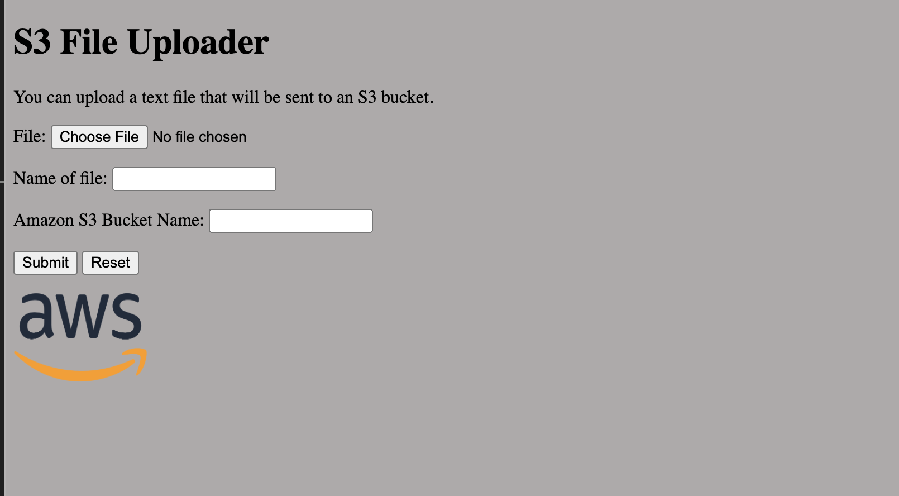
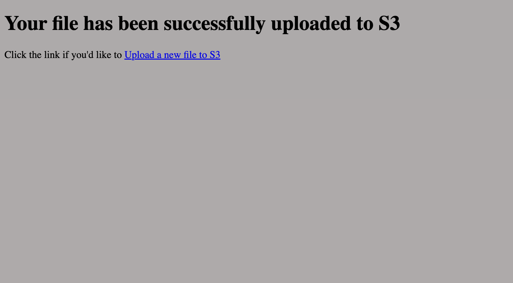

# Project Beyond

Spring Boot Web Application that allows users to upload file to an S3 bucket.
Made by Julian Saturno and Trevian Joubert 2024

---
This repository contains resources and Java files for building a spring
boot application that uploads an file to a public S3 bucket.

## Pre-requisites

You must have an AWS account and Java 17 SDK.

## Java Classes

Description of all the Java Classes used in this project.

### projectBeyondApplication class - Main Spring Boot Java class

Entry point of Spring Boot application to bootstrap and configure for launch.

### ReceivedInfo class - Model class

Model for the Spring Boot application. Contains the input values obtained from the startup template.

### S3Uploader class - S3 API class

Takes inputs from the /received endpoint (bucket name, file, and file name) to upload the file into requested Amazon S3 Bucket. This class assumes the bucket exists in the us-east-1 region.

### StartupController - Spring Boot Controller class

Functions as controller for the Spring Boot application by handling the HTTP requests and returns each template view.

## HTML Files

Description of all the HTML files included in this project.

### Startup HTML

The introductory page when interacting with the Spring Boot application. The page allows for input of the file to upload, the file name, and the Amazon S3 bucket name.

### Result HTML

The redirecting page after the submit button is clicked. Functions as the acknowledgement that the file is uploaded to the bucket.

## Cloud Technologies

Description of the Cloud Technologies used to deploy the Spring Boot applicaiton.

### AWS Elastic Beanstalk
Used to deploy the application so it is available from a public URL.

### Amazon S3
Used to upload the file to the provided bucket name.